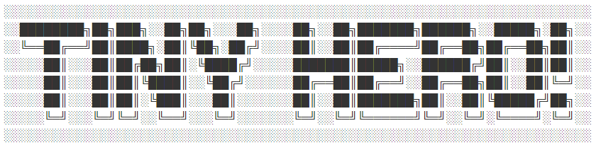
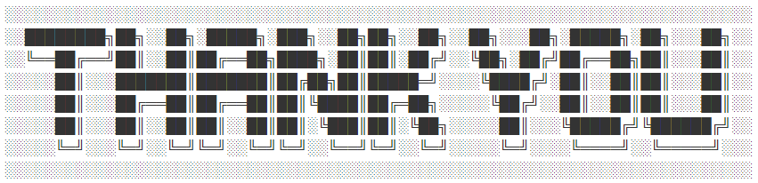

# Ruby Terminal Application (T1A3) 


Link to this Repository - [Terminal App Repo](https://github.com/sam-lee-py/Terminal_Application)

<hr/>


Installation instructions :

1. Get the repository from the link. [Game Repository](https://github.com/sam-lee-py/Terminal_Application)
2. Go to `src` folder.  `cd src`
3. Run the `install.sh` file in terminal. `sh install.sh`
    ```sh
    cd src
    sh install.sh
    ```
    This will install the gem bundler and the gems needed.

    **System Require**
    - Ruby v2.4 or later
    - Mac OS or Windows OS (with WSL prefer Ubuntun)

    **Dependencies**
    - tty-prompt (0.23.1)
    - tty-box (0.7.0)
    - colorize (0.8.1)
    - artii (2.1.2)
    - json (2.6.1)

<hr/>


Statement of Purpose :

Tiny hero is a text-based game. Player acting as a summoned hero into a endless nightmare. Survive as long as possible is the main purpose of this game. The 3 longest surviving heroes will be displayed in hall of fame. As a game controlled by dice, everything is uncertain. The hero may miss the attack, the run may fail, and even the number of gold dropped is random. Player can use the store to buy potions to improve hero abilities. That will help the hero survive longer. 

This game is the first project I developed while studying Ruby. As a game lover, I find that there is more enthusiasm and motivation when developing games. This will encourage me to solve the problems in studying. As a newbee, I learned a lot during this development process, have a rough idea for future development. 

This game target audience is the new ruby developer or the text-based game player. New ruby developer could use this as the really good sample to understand how a poject build from scratch, or treat it as a good or bad example. Players can play this and I will continue to update the game to add more ideas.

<hr/>


Features of tiny hero :

- The clear menu system. Each of them clearly guides the player to where they want to go. By use the tty-prompt gem, It's much easier to control the input. 

- Uncertainty. Like the D&D board game, in tiny hero everything base ont the dice. Hero's ability, shop list, the attack damge even the running success rate all based on the dice. This uncertainty brings more fun to the game.
  
- Freedom. In tiny hero, players can choose whatever they want to do. they could shopping in the shop, or start a battle with being fully prepared. They could choose the move in battle. Use their own skill to make heroes survive longer.

- Repeat play. Because the Hall of Fame only show the 3 longest surviving heroes, it's stimulate repetitive play.

- Challenging difficulty. Monster in tiny hero, increase their abilities by days. Players will find that monsters will get stronger and stronger, especially if they last for more than 15 days. This will require players to use every option reasonably and wisely, if they want survive longer.
  - By using the random system, we could build different monsters and their abilities relative to the days, So it will ensure the battle have challenge.
  

- Stop any time. By using the json, this game will save all the status to json file like hash. Key is the hero's name. This ensure the uniqueness of the hero's name as well.

- Character class and Monster class make the save file simple and easy to load.
In tiny hero characters and monsters build by using Character class and Monster class. Character build needs 6 attributes but Monster object build only need one. This will keep the save files simple and small.
  
 
- Visual performance. Due to the limitations of the my ability and terminal app, I try my best to make the visual performance as good as possible. Use the artii font and tty-box to separate the terminal window into 2 parts. Selection and type will always keep at the bottom part, the top part will show the character abilities and some basic information.

  

- Percentage progress, After studying how to use ruby to control the terminal. I build a cool percentage progress in the install page. It will flush and repeat print in one line to make it like an animation effect.

- The error message will show on the screen when there is some problem. Like the name already exists or the price is too expensive for the hero.
   - 
   - 

<hr/>


Outline and flow chart for tiny hero :

- The overall flow chart will show how the game proceeds.

  

- By use `install.sh` to install and lead user go to the install page.

  

- After the install and see the very cool percentage progress. The player will see the main menu, which is the start of the game.

  

- The player will see 4 selections. Here is the flowchart to explain how this main menu works.

  

- After build new character or select load game player will go to the daily menu.

  

- The player will see 4 selections. Here is the flowchart to explain how this daily menu works.

  

- Hall of Fame page, show the 3 longest surviving heroes names and their surviving days.

  

<hr/>


Implementation plan use trello : [link](https://trello.com/b/8HdBAS8b/terminalapplication)


<hr/>


<hr/>
